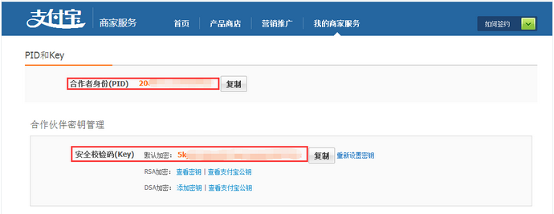
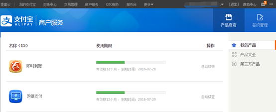
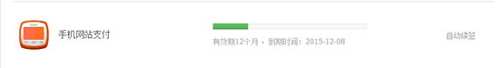

##支付宝配置

##### 队员缴费直接缴费到组委会的支付宝账户，组委会需要提供下面的信息：
 1. 组委会名称
 2. 合作者身份ID（以2088开头的16位纯数字）
 3. 安全校验码（Key）
 4. 确定已签约即时到帐和手机网站支付功能

##### 一.填写和查看 PID 和支付宝安全校验码（Key）
1. 填写和查看参数的页面[点击查看](https://b.alipay.com/order/pidAndKey.htm)
2. 合作者身份（PID）和安全校验码（Key）在下图 所示的位置

##### 二.检查是否已签约「即时到账」和 「手机网站支付」
1. 在填写支付宝参数之前请确保你已经签约了「即时到账」。（「即时到账」是用于 PC 端网页内的支付方式，默认形态为扫码）

2. 在签约产品列表页面（[点击查看](https://b.alipay.com/order/products.htm?channel=ent)），你会看到你的签约产品列表，如下图 所示。
 
 如果我的产品中有下图 所示的产品，则说明已签约「即时到账」。
 
 如果我的产品中有下图 所示的产品，则说明已签约「手机网站支付」。
