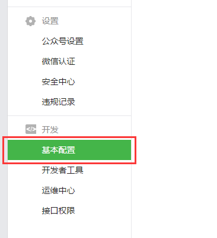
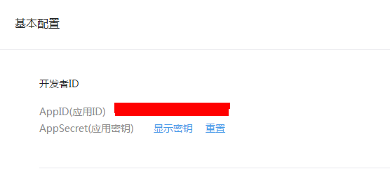
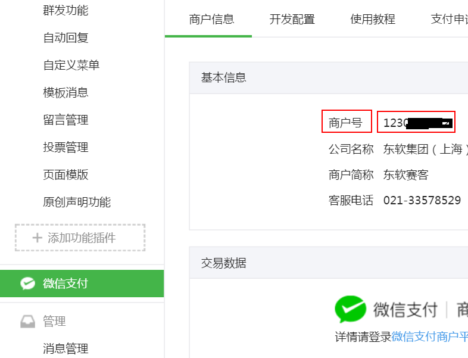
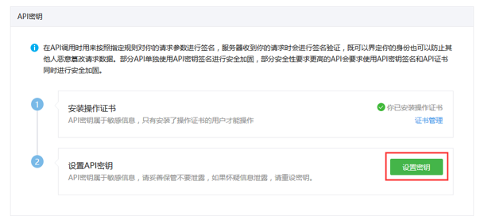
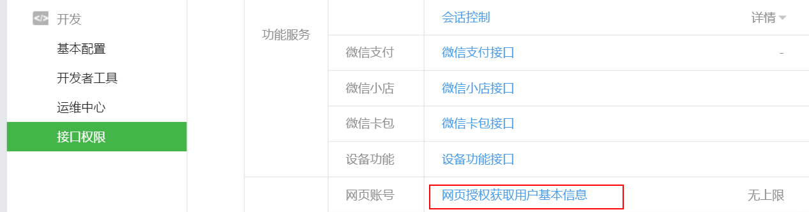
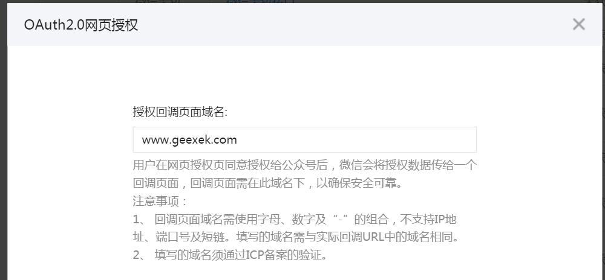
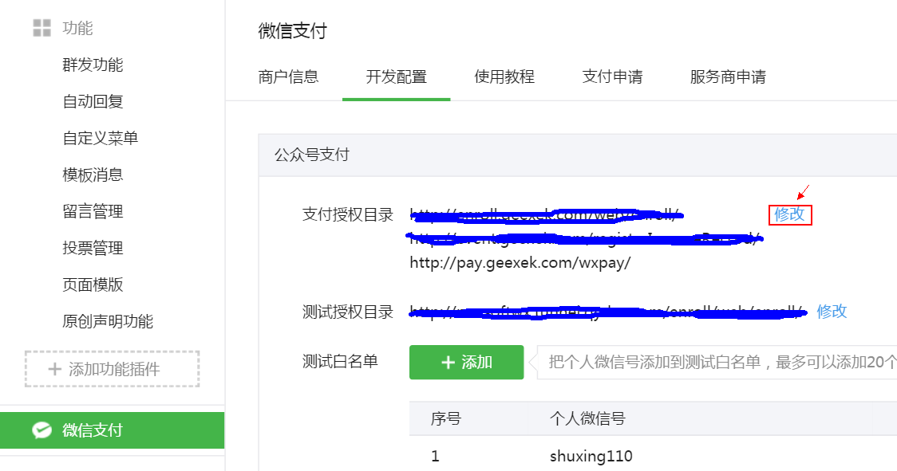
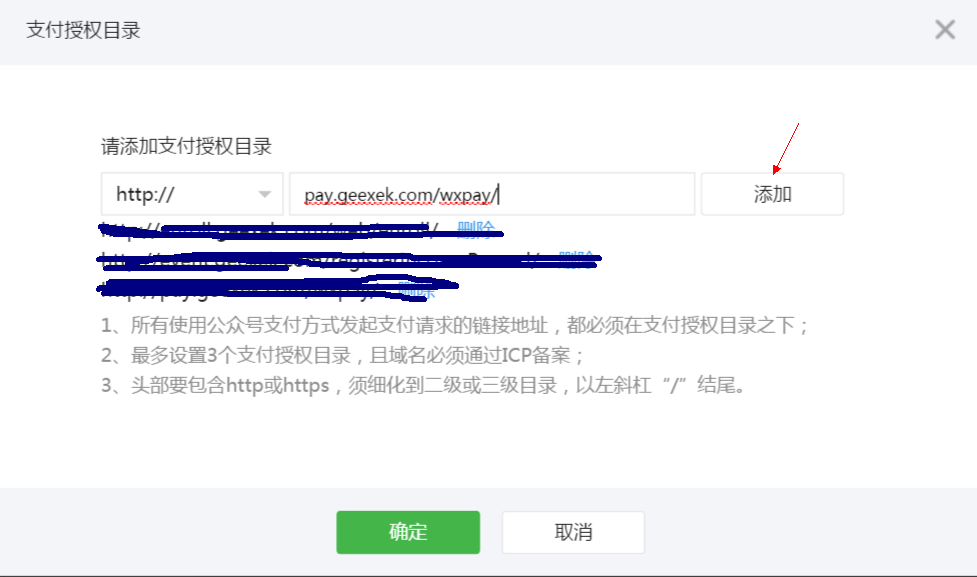

### 微信配置
##### 队员缴费直接缴费到组委会的微信账户，组委会需要提供下面的信息：
 1. 组委会名称
 2. 微信公众号 AppID 和应用密钥（AppSecret）
 3. 商户ID和商户支付密钥（API 密钥）
 4. 确定网页授权回调域名是www.geexek.com
 5. 确定支付授权目录是http://enroll.geexek.com/web/enroll/

##### 一.获取微信公众号 AppID 和应用密钥（AppSecret）
登录微信公众平台（[点击登陆](http://mp.weixin.qq.com/)），点击左侧底部的「开发 - 基本配置」，可查看到 AppID 和应用密钥（AppSecret）。
注：应用密钥必须是点击「显示密钥」后再复制，如未成为开发者需在此页面先成为开发者。

##### 二.获取商户ID和商户支付密钥（API 密钥）
1. 商户ID
  点击左侧「微信支付」，可看到商户信息一栏，下面基本信息中的商户号即是商户ID
  
2. 商户支付密钥（API 密钥）
   登陆微信商户平台（[点击登陆](http://pay.weixin.qq.com/)）。
   点击「账户中心 - 账户设置 - API 安全」（第一次登陆会提示你安装操作证书，请先安装操作证书）。
   点击「设置密钥」，设置自己的密钥，该设置的密钥即为商户支付密钥（API 密钥）
   
##### 三.设置网页授权回调域名
在微信公共号平台点击左侧底部的「开发 - 接口权限」，修改 网页授权获取用户基本信息

点击左侧修改，填入www.geexek.com

##### 四.配置支付授权目录
点击左侧「微信支付」，在开发配置一栏，修改支付授权目录
填入:pay.geexek.com/wxpay/
 
 
